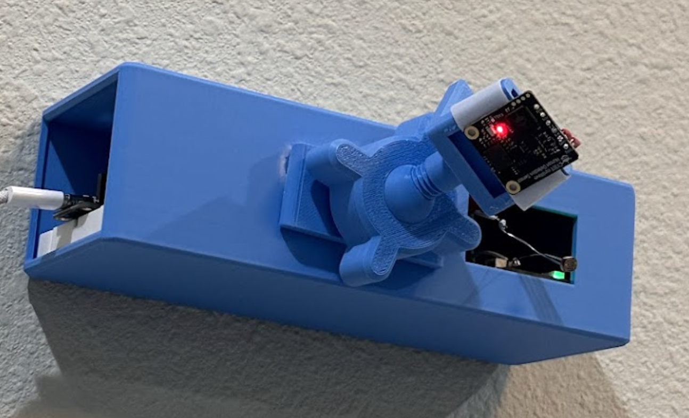
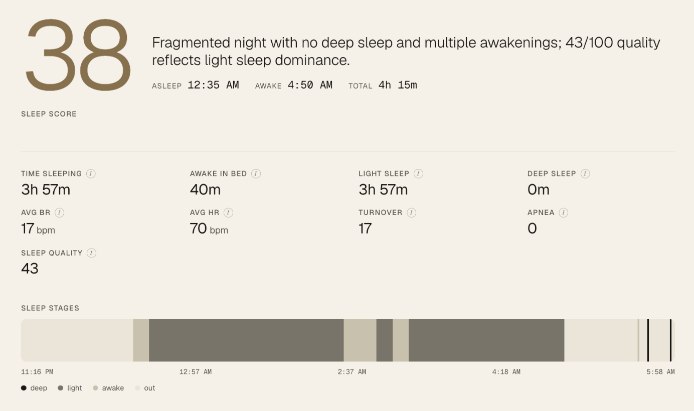
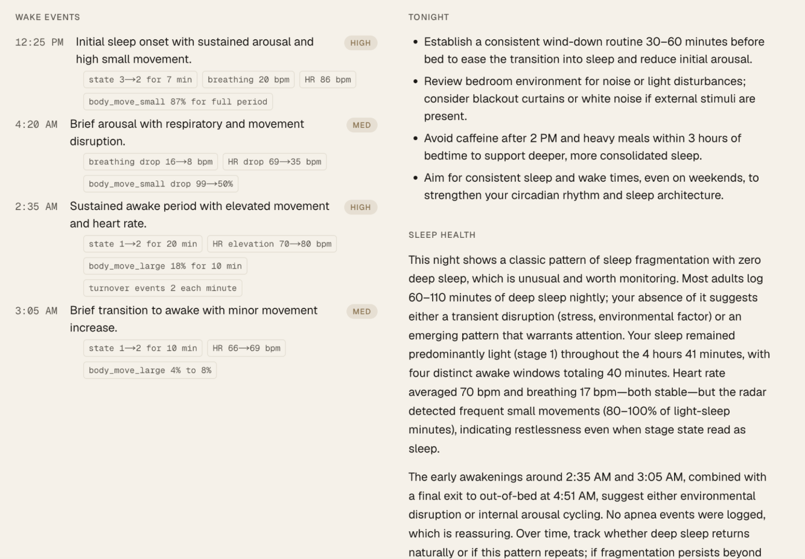
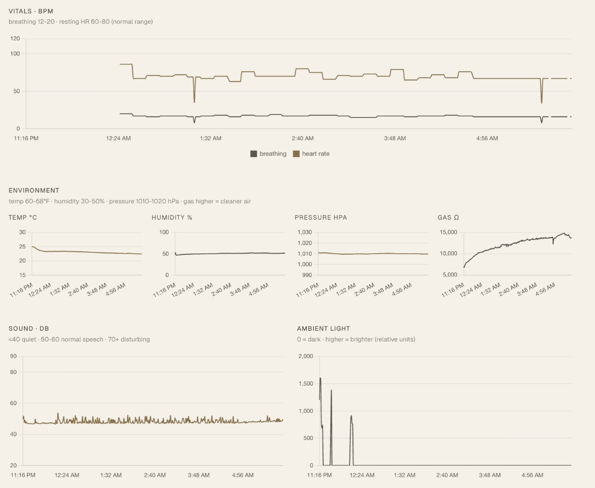

# Sleep Monitor

**Contactless bedside sleep tracker that explains *why* you slept badly — no wearable required.**

A 60 GHz mmWave radar watches your breathing, heart rate, and sleep stages from across the room while environmental sensors log everything that could wake you. Each arousal gets tagged with its likely cause, and Claude writes you a morning briefing.

<p>
  
  
  
  
  
  
  
  
</p>

<p align="center">
  
  <br>
  <em>The assembled node — ESP32 Feather + 60 GHz radar in a 3D-printed enclosure on a ball-joint wall mount.</em>
</p>

---

## Why

A third of adults sleep poorly, but consumer trackers demand nightly wearable compliance and still can't tell you *why* you woke up. This node sits on the nightstand, sees nothing but radar reflections and room conditions, and turns a night of raw telemetry into a plain-English explanation by morning.

## What it does

- **Contactless sleep staging** — awake / light / deep, with no wearable, from 0.4–2.5 m away
- **Live vitals in bed** — breathing rate and heart rate straight off the radar
- **Per-minute environment log** — temperature, humidity, pressure, gas/VOC air quality, noise (dB SPL), light
- **Annotated wake events** — every arousal tagged with its likely cause: noise spike, temperature drift, or light
- **AI morning briefing** — Claude turns the night into a sleep score, headline, wake-cause list, and 1–3 recommendations
- **Edge-side audio privacy** — raw mic samples never leave the device; only a computed dB SPL value is published

## How it works

```
USB-C wall ──> [Feather V2 ESP32] ──5V──> [C1001 60 GHz mmWave radar]
                       │  3V3
                       ├──I2C──> [BME680  temp/humidity/pressure/gas]
                       ├──ADC──> [SPW2430 mic  → on-device RMS → dB SPL]
                       └──ADC──> [Photoresistor  light]
                       │
                       └──Wi-Fi / MQTT / TLS──> [HiveMQ Cloud]
                                                      │
                                                      ▼
                                       [Next.js app on Railway]
                                         ├── MQTT subscriber (instrumentation.ts)
                                         ├── Postgres (telemetry / nights / reports)
                                         ├── Wake detection + correlation engine
                                         ├── Claude API → morning briefing
                                         └── Dashboard (Chart.js timeline)
```

The ESP32 publishes a ~350-byte JSON snapshot every 30 s. A single Next.js app subscribes over TLS, stores each row, and runs in-memory wake detection. When a sleep session ends it bundles the night, sends it to Claude, and stores a structured report the dashboard renders the next morning.

## The dashboard

**AI morning briefing** — a sleep score, plain-English headline, the stage breakdown, and overnight sleep-stage bands.



**Annotated wake events** — each arousal paired with its likely cause and concrete recommendations for the next night.



**Overnight telemetry** — vitals (breathing + heart rate) over the full night, with the environmental signals that drive wake-cause correlation.



## Tech stack

| Layer | Stack |
|---|---|
| Firmware | PlatformIO · Arduino · ESP32 Feather V2 · PubSubClient · ArduinoJson |
| Sensing | DFRobot C1001 mmWave (UART) · BME680 (I²C) · SPW2430 mic + photoresistor (ADC) |
| Transport | MQTT over TLS · HiveMQ Cloud |
| Backend | Next.js 15 App Router · TypeScript · Postgres |
| AI | Anthropic Claude API (Haiku 4.5) with prompt caching |
| Dashboard | React · Tailwind CSS · Chart.js |
| Hosting | Railway (app + Postgres add-on) |

## Hardware (single node)

- Adafruit ESP32 Feather V2 (USB-C wall powered)
- DFRobot C1001 60 GHz mmWave radar — presence, sleep stages, breathing, heart rate
- BME680 — temperature, humidity, pressure, gas/VOC
- SPW2430 analog MEMS microphone + photoresistor (10 kΩ pull-down)
- 3D-printed enclosure + ball-joint wall mount (6 printed parts, see [PRINT-PLAN.md](PRINT-PLAN.md))

## Layout

| Folder | What |
|---|---|
| `firmware/` | PlatformIO project for the Feather V2 |
| `web/` | Next.js 15 app: MQTT subscriber + Postgres + Claude + dashboard |
| `cad/` | CadQuery scripts + STL files for the 3D-printed parts |
| `cad/final/` | The 6 STLs to print (numbered in build order) |

## Quick start

```bash
# Firmware — flash the Feather V2
cd firmware && pio run -t upload    # see firmware/README.md for config.h setup

# Web — local dev
cd web && npm install && npm run dev # see web/README.md for env vars + deploy
```

## Docs

- [PRD.md](PRD.md) — product requirements
- [TECH-SPEC.md](TECH-SPEC.md) — technical spec (firmware, MQTT, backend, dashboard)
- [DESIGN.md](DESIGN.md) — hardware design
- [WIRING.md](WIRING.md) — pin-by-pin wiring guide
- [PRINT-PLAN.md](PRINT-PLAN.md) — 3D print + assembly plan
